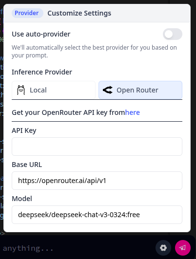

# DeepSite Локально 🚀



Запустите **DeepSite** в своей собственной среде, без зависимости от Hugging Face!  
Идеально подходит для тех, кто хочет настраивать, интегрировать или просто иметь полный контроль над платформой.

> 💡 **DeepSite** — это инструмент для создания сайтов с использованием мощных ИИ технологий, таких как **DeepSeek**. Проект создан командой **A-K Project**.

---

## Как запустить DeepSite локально

### 1. Клонируйте репозиторий
```bash
git clone https://github.com/TETRIX8/aksite  
```

### 2. Установите зависимости
(Убедитесь, что у вас установлен **Node.js** ✅)
```bash
npm install
```

### 3. Соберите проект
```bash
npm run build
```

### 4. Запустите сервер
```bash
npm run start
```

Теперь ваш **DeepSite** будет доступен локально! 🎉

---

### Основные преимущества запуска DeepSite локально:

🌟 **Полный контроль**: Настраивайте и изменяйте платформу под свои нужды.  
🚀 **Автономный режим**: Работает без подключения к интернету.  
🛠️ **Интеграция**: Легко интегрируйте с другими инструментами и сервисами.  

---

### Ключевые слова:
deepsite локальный хостинг, deepsite запуск локально, deepsite автономный режим, как запустить deepsite на своем компьютере, настройка deepsite локально, deepsite localhost пошаговое руководство, deepsite docker установка, требования для запуска deepsite локально, сравнение deepsite локальный хостинг vs облачный хостинг, советы по производительности deepsite, распространенные ошибки и их исправления, создание сайтов с помощью deepseek, проект a-k project.

---

💡 **DeepSite** — это не просто инструмент, это возможность создавать уникальные сайты с помощью технологий искусственного интеллекта, таких как **DeepSeek**, разработанных в рамках проекта **A-K Project**. Запустите его локально и получите полную свободу действий! 🌐✨
